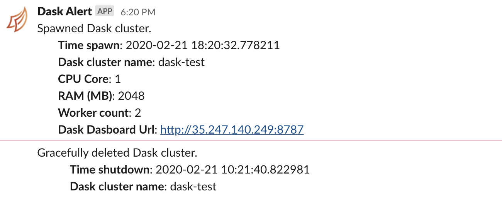

<p align="center">
    <a href="#readme">
        
    </a>
</p>

---

**ondemand-dask**, Dask cluster on demand and gracefully delete itself after idle for certain period. Right now only support GCP.

## Table of contents
  * [Problem statement](#problem-statement)
  * [Installing from PyPI](#installing-from-pypi)
  * [Usage](#usage)
    * [ondemand_dask.build_image](#ondemand_daskbuild_image)
    * [ondemand_dask.spawn](#ondemand_daskspawn)
    * [ondemand_dask.delete](#ondemand_daskdelete)
    * [ondemand_dask.function.post_slack](#ondemand_daskfunctionpost_slack)
    * [ondemand_dask.important_libraries](#ondemand_daskimportant_libraries)
    * [ondemand_dask.extra_libraries](#ondemand_daskextra_libraries)
  * [Custom](#custom)
  * [Example](#example)

## Problem statement

Dask is really a great library for distributed programming using Python scale up more than 1TB data. Traditionally, we spawned a Dask cluster using VM or Kubernetes to process our data, and after that, Dask cluster will idle probably most of the time. We got charged even Dask cluster in idle mode (no computation happened).

So this library will help you to spawn a Dask cluster with custom size of CPU, RAM and worker, and automatically gracefully delete itself after idle for certain period.

It also support simple alert system to post message during spawning and gracefully delete, default is Slack.

## Installing from PyPI

```bash
pip install ondemand-dask
```

## Before use

**Make sure your machine already installed gcloud SDK and your GCP account powerful enough to spawn compute engine and upload to google storage**.

If not, simply download gcloud SDK, https://cloud.google.com/sdk/docs/downloads-versioned-archives, after that,

```bash
gcloud init
```

## usage

1. Build image, this process only need to be done once, [ondemand_dask.build_image](#ondemand_daskbuild_image)
2. Spawn a cluster, [ondemand_dask.spawn](#ondemand_daskspawn)

#### ondemand_dask.build_image

```python

def build_image(
    project: str,
    zone: str,
    bucket_name: str,
    instance_name: str,
    image_name: str,
    project_vm: str = 'ubuntu-os-cloud',
    family_vm: str = 'ubuntu-1804-lts',
    storage_image: str = 'asia-southeast1',
    webhook_function: Callable = post_slack,
    validate_webhook: bool = True,
    additional_libraries: List[str] = extra_libraries,
    install_bash: str = None,
    **kwargs
):
    """
    Parameters
    ----------

    project: str
        project id
    zone: str
    bucket_name: str
        bucket name to upload dask code, can be private.
    image_name: str
        image name for dask bootloader.
    project_vm: str, (default='ubuntu-os-cloud')
        project name for vm. 
    family_vm: str, (default='ubuntu-1804-lts')
        family name for vm.
    storage_image: str, (default='asia-southeast1')
        storage location for dask image.
    webhook_function: Callable, (default=post_slack)
        Callable function to send alert during gracefully delete, default is post_slack.
    validate_webhook: bool, (default=True)
        if True, will validate `webhook_function`. 
        Not suggest to set it as False because this webhook_function will use during gracefully delete.
    additional_libraries: List[str], (default=extra_libraries). 
        add more libraries from PYPI. This is necessary if want dask cluster able to necessary libraries.
    **kwargs:
        Keyword arguments to pass to webhook_function.
    """

```

Usage is simply,

```python
import ondemand_dask

project = 'project'
zone = 'asia-southeast1-a'
bucket_name = 'bucket'
instance_name = 'dask-build'
image_name = 'dask-image'
webhook_slack = 'https://hooks.slack.com/services/'

ondemand_dask.build_image(
    project = project,
    zone = zone,
    bucket_name = bucket_name,
    instance_name = instance_name,
    image_name = instance_name,
    webhook = webhook_slack,
)
```

**Building image took around 5-7 mins**.

For complete example, check [example/upload.ipynb](example/upload.ipynb).

For custom webhook function and additional libraries for Dask cluster, check [custom](#custom).

#### ondemand_dask.spawn

```python
def spawn(
    cluster_name: str,
    image_name: str,
    project: str,
    zone: str,
    cpu: int,
    ram: int,
    worker_size: int,
    disk_size: int = 10,
    check_exist: bool = True,
    preemptible: bool = False,
    graceful_delete: int = 180,
    webhook_function: Callable = post_slack,
    **kwargs,
):
    """
    function to spawn a dask cluster.

    parameter
    ---------

    cluster_name: str
        dask cluster name.
    image_name: str
        image name we built.
    project: str
        project id inside gcp.
    zone: str
        compute zone for the cluster.
    cpu: int
        cpu core count.
    ram: int
        ram size in term of MB.
    worker_size: int
        worker size of dask cluster, good value should be worker size = 2 * cpu core.
    disk_size: int, (default=10)
        Disk size (GB) for the dask cluster.
    check_exist: bool, (default=True)
        if True, will check the cluster exist. If exist, will return ip address.
    preemptible: bool, (default=False)
        if True, will use preemptible VM, low cost and short life span. 
        Read more, https://cloud.google.com/compute/docs/instances/preemptible
    graceful_delete: int, (default=180)
        Dask will automatically delete itself if no process after graceful_delete (seconds).
    webhook_function: Callable, (default=post_slack)
        Callable function to send alert, default is post_slack.
    **kwargs:
        Keyword arguments to pass to webhook_function.

    Returns
    -------
    dictionary: {'ip': ip_address, 'internal_ip': internal_ip}
    """
```

Usage is simply,

```python
import ondemand_dask

cluster_name = 'dask-test'
image_name = 'dask-build'
project = 'project'
cpu = 1
ram = 2048
zone = 'asia-southeast1-a'
worker_size = 2
graceful_delete = 60 # graceful delete after 60 seconds
webhook = 'https://hooks.slack.com/services/'

ondemand_dask.spawn(
    cluster_name = cluster_name,
    image_name = image_name,
    project = project,
    cpu = cpu,
    ram = ram,
    zone = zone,
    worker_size = worker_size,
    graceful_delete = graceful_delete,
    webhook = webhook,
)
```

**Spawning a cluster took around 1-3 mins**.

After a while, Dask deleted itself,



For complete example, check [example/spawn.ipynb](example/spawn.ipynb).

#### ondemand_dask.delete

```python

def delete(cluster_name: str, project: str, zone: str):
    """
    function to delete dask cluster.

    parameter
    ---------

    cluster_name: str
        dask cluster name.
    project: str
        project id inside gcp.
    zone: str
        compute zone for the cluster.
    """
```

This function is delete a dask cluster manually.

#### ondemand_dask.function.post_slack

```python

def post_slack(
    slack_msg: str,
    webhook: str = None,
    username: str = 'Dask Alert',
    icon_url: str = 'https://avatars3.githubusercontent.com/u/17131925?s=400&v=4',
    **kwargs
):
    payload = {'text': slack_msg, 'username': username, 'icon_url': icon_url}
    return requests.post(webhook, json = payload).status_code

```

Default `ondemand_dask.build_image` and `ondemand_dask.spawn` are using `ondemand_dask.function.post_slack`.

To overwrite, simply pass keyword arguments,

```python

ondemand_dask.build_image(
    webhook = webhook,
    username = username
)

```

#### ondemand_dask.important_libraries

These are default libraries will install in dask cluster,

```python

['dask[complete]==2.11.0',
 'distributed==2.11.0',
 'cloudpickle==1.3.0',
 'ondemand-dask',
 'google-api-python-client',
 'jupyter-server-proxy',
 'google-cloud-storage',
 'bokeh',
 'google-cloud-bigquery',
 'gcsfs',
 'sqlalchemy',
 'dill']

```

#### ondemand_dask.extra_libraries

These are extra libraries will install in dask cluster,

```python

['streamz',
 'confluent-kafka',
 'requests',
 'prometheus_client',
 'elasticsearch',
 'sentry-sdk',
 'influxdb',
 'pandas==0.25.3',
 'psycopg2-binary',
 'sklearn',
 'scikit-learn==0.22.1',
 'numpy',
 'scipy',
 'fuzzywuzzy[speedup]',
 'pendulum']

```

To overwrite these libraries during building image, simply,

```python

more_libraries = ['tensorflow', 'rapids']
ondemand_dask.build_image(
    project = project,
    zone = zone,
    bucket_name = bucket_name,
    instance_name = instance_name,
    image_name = instance_name,
    additional_libraries = more_libraries
)

```


## custom

Building image only need to do once, unless,

1. Custom alert platform, eg, Telegram, Discord and etc.

```python

# only accept one parameter.
def post_to_platform(msg: str):
    status_code = do something
    return status_code

ondemand_dask.build_image(
    project = project,
    zone = zone,
    bucket_name = bucket_name,
    instance_name = instance_name,
    image_name = instance_name,
    webhook_function = post_to_platform
    # webhook not required, only required if not overwrite `webhook_function`
)
```

**You need to make sure function `post_to_platform` returned 200**.

2. Added more libraries inside dask cluster,

```python

more_libraries = ['tensorflow', 'rapids']
ondemand_dask.build_image(
    project = project,
    zone = zone,
    bucket_name = bucket_name,
    instance_name = instance_name,
    image_name = instance_name,
    additional_libraries = more_libraries
)

```

## Example

1. Build a dask image, [upload.ipynb](example/upload.ipynb).
2. Spawn a dask cluster from last built dask image and wait gracefully delete itself, [spawn.ipynb](example/spawn.ipynb).
3. Spawn a dask cluster and do some computation, [spawn-run.ipynb](example/spawn-run.ipynb).